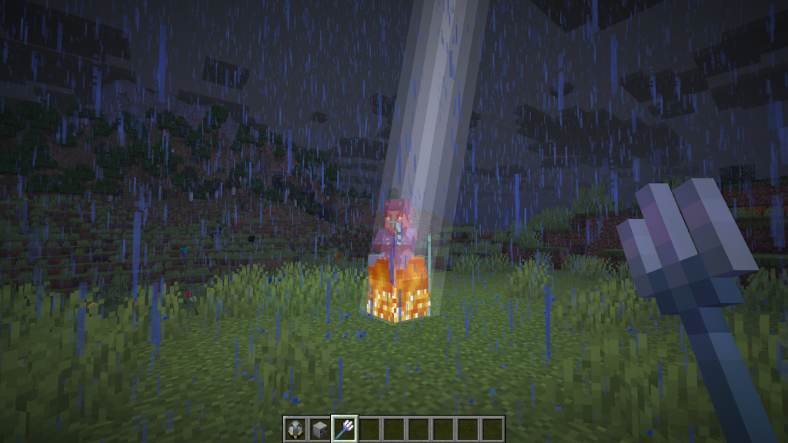

# MobHeads

MobHeads is a lightweight collection mod that adds collectible heads for every vanilla creature in Minecraft.
MobHeads focuses on collecting, exploration, and achievement while staying true to the game.

Illusioner Summoning
## Features
- Collect heads from every vanilla mob and variant
- Advancement-based collection tracking
- Vanilla-inspired summoning mechanics for hidden mobs
- Fully configurable using Cloth Config
- Compatible with existing worlds

## Downloads
Modrinth: https://modrinth.com/mod/nitroito-mobheads

## Links
**Source**: https://github.com/Nitroito/Nitroito-MobHeads 
**Issues**: https://github.com/Nitroito/Nitroito-MobHeads/issues

---

*This project is licensed under the MIT License.*